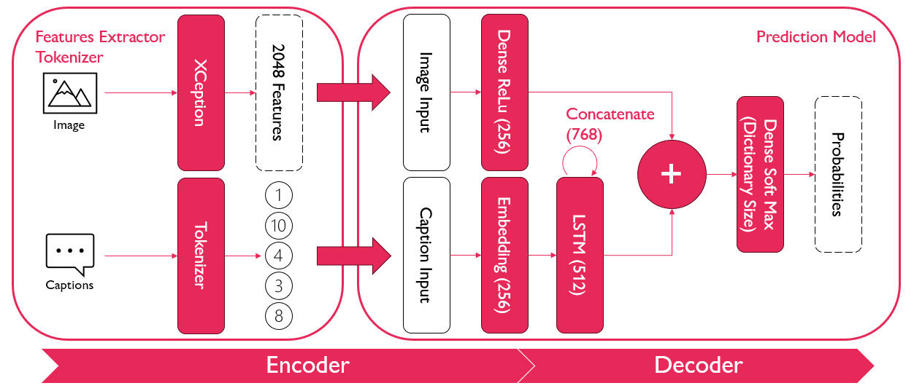

# Projects
This repository contains my work on some of the projects I have completed or I am currently developing.
## [Masters Degree Projects](https://github.com/Nunzi99/Projects/tree/main/UNI_projects)
During my Masters degree in Artificial Intelligence I have completed several projects related to Machine Learning and Deep Learning.

You can reach the repositories for all those projects by clicking on the link above or the following link.

### [Deep_Learning](https://github.com/Nunzi99/Projects/tree/main/UNI_projects/Deep_Learning)
The projects related to Deep Learning are focused on implementing an image captioning algorithm using an encoder-decoder architecture and a sentiment analysis one using Transformers.

- [Image Captioning](https://github.com/Nunzi99/Projects/tree/main/UNI_projects/Deep_Learning/Image_Captioning)
- [Sentiment Analysis](https://github.com/Nunzi99/Projects/tree/main/UNI_projects/Deep_Learning/Sentiment_Analysis)

As an example here is the architecture of the image captioning model:
 
And here some of the results that the sentiment analysis model obtains:

### [Machine_Learning](https://github.com/Nunzi99/Projects/tree/main/UNI_projects/Machine_Learning)
Regarding my projects related to Machine Learning i have developed custom implementations of some of the most common machine learning algorithms and compared them with the results obtained with the same algorithms implemented in scikit-learn.

- K-NN Regression
- Logistic Regression For Classification
- K-Means ++ For Clustering
