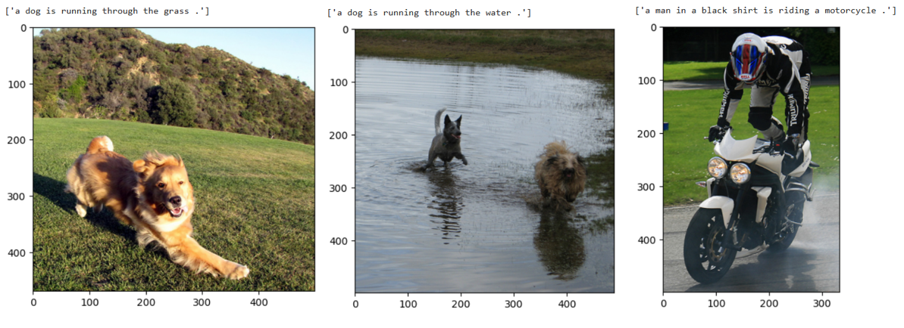

# Image Captioning

## Introduction

This project focuses on building an image captioning model using an encoder-decoder architecture.

The model is trained on the Flickr8k dataset and using Google Colab in order to satisfy the GPU requirements.

## Architecture

The training images are processed using XCeption CNN with imagenet weights, this produce 2048 features for each image which are then processed by a 256 neurons Dense layer.

The captions are first of all used to train a tokenizer and then tokenized into sequences of integers, this sequence then gets processed by an Embedding layer and the output of this layer is used by an LSTM layer.

The output of the Dense layer is then combined with the output of the LSTM layer to produce the input for the final Dense layer which has a number of neurons equal to the size of the tokenizer vocubulary, this layer then produce the probabilities of each word of the dictionary to be the next word.

This is the architecture of the model:

These are some of the results the model obtains:

