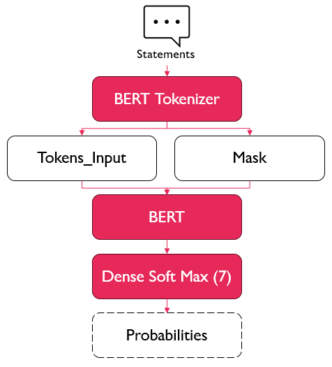

# Sentiment Analysis

## Introduction

This project focuses on building a sentiment analysis model using the BERT language model trained on the [Sentiment Analysis for Mental Health](https://www.kaggle.com/datasets/suchintikasarkar/sentiment-analysis-for-mental-health) dataset from Kaggle.

The goal of this model is to predict from a text message if the author shows signs of mental distress or not.

Note that this is a very complex medical problem and the results are not to be considered medical advice, but it's a good example of how AI and deep learning could be used to help with early detection of mental health issues and other social problems.

In order to meet the computational requirements of this project I have used Google Colab to train the model.
## Architecture

The architecture is pretty straightforward:

- The statements are processed using the tokenizer from the BERT model
- This outputs the token embeddings and the attention masks
- These are then passed to the BERT model
- Finally the output of the BERT model is used by a Dense layer with a number of neurons equal to the number of possible mental states in our dataset (7 in this case) to produce the probabilities of each mental state

This is the architecture of the model:

These are some of the results the model obtains:

