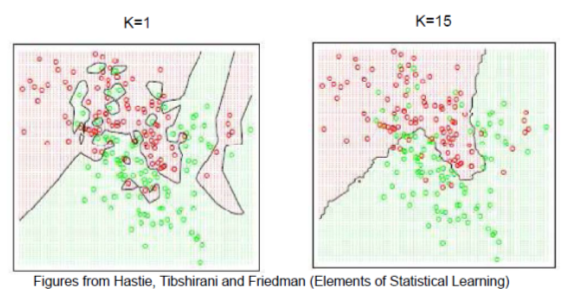
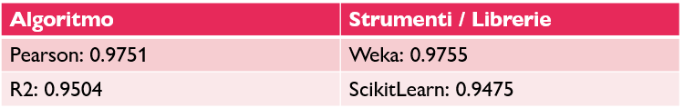
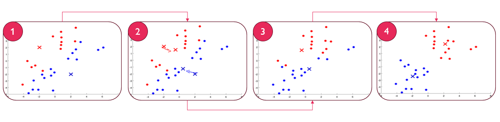
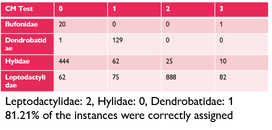

# Machine Learning

The objective of these projects was to learn what are the best alghorithms to use for a given problem and dataset in order to implement them in Python to reach a good level of understanding of the key principles of machine learning.

The results of those custom implementations were then compared with those obtained with scikit-learn in order to understand if the custom implementations were good enough for a given problem.

These are the algorithms I have implemented:

## [K-NN Regression](https://github.com/Nunzi99/AI_projects/tree/main/UNI_projects/Machine_Learning/K-NN_Regression)

For the regression task I have implemented a custom implementation of the K-NN algorithm in order to predict the net hourly energy output of a Combined Cycle Power Plant given the ambient temperature, the ambient pressure, the relative humidity and the exhaust vacuum of the plant.

The dataset used was the [Combined Cycle Power Plant](https://archive.ics.uci.edu/ml/datasets/Combined+Cycle+Power+Plant) from the UCI Machine Learning Repository.

Due to the low dimensionality of the dataset and the high amount of data points the K-NN alghorithm was the ideal choice for this regression task.

These are the accuracies obtained with the custom implementation and the scikit-learn implementation:

## [Logistic Regression For Classification](https://github.com/Nunzi99/AI_projects/tree/main/UNI_projects/Machine_Learning/Logistic_Regression)

For the classification task I implemented the Logistic Regression algorithm with the goal of predicting if a certain tumoral breast mass is malignant or benign.

The dataset used was the [Breast Cancer Wisconsin (Diagnostic) Data Set](https://archive.ics.uci.edu/dataset/17/breast+cancer+wisconsin+diagnostic) from the UCI Machine Learning Repository.

The results of the custom implementation were pretty good and similar to those obtained with scikit-learn.
- Accuracy Custom Implementation: 0.94 vs Accuracy scikit-learn: 0.94
- Recall Custom Implementation: 0.94 vs Recall scikit-learn: 0.98
- Specificity Custom Implementation: 0.93 vs Specificity scikit-learn: 0.98

## [K-Means ++ For Clustering](https://github.com/Nunzi99/AI_projects/tree/main/UNI_projects/Machine_Learning/K-Means++)

For the clustering task I implemented the K-Means++ algorithm to cluster the [Anuran Calls (MFCCs)](https://archive.ics.uci.edu/dataset/406/anuran+calls+mfccs) dataset from the UCI Machine Learning Repository.

Due to the fact that clustering is an unsupervised learning problem the results weren't as good as the previous implementations but they were still pretty good.

