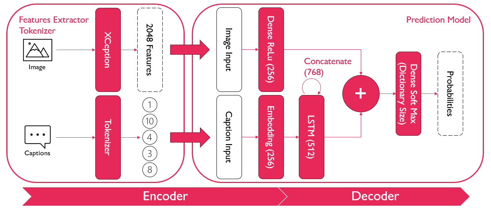
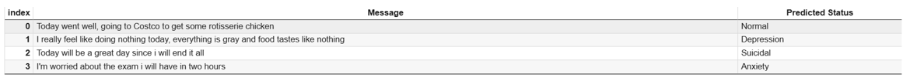

# UNI Projects

This folder contains the projects I have completed during my Masters degree in Artificial Intelligence.

The projects are mainly related to Machine Learning and Deep Learning implementations and developed in Python or Jupyter Notebooks.

## [Deep Learning](https://github.com/Nunzi99/AI_projects/tree/main/UNI_projects/Deep_Learning)

The goal of the Deep Learning projects was to learn how to implement deep learning models in order to solve complex problems.

It was key to have a good understanding of the datasets, the best architectures to use and how to build the final model.

The two problems I focused on were:

- [Image Captioning](https://github.com/Nunzi99/AI_projects/tree/main/UNI_projects/Deep_Learning/Image_Captioning): using an encoder-decoder architecture to generate captions for images from the Flickr8k dataset from Kaggle.
- [Sentiment Analysis](https://github.com/Nunzi99/AI_projects/tree/main/UNI_projects/Deep_Learning/Sentiment_Analysis): developing a sentiment analysis model using the BERT language model trained on the Sentiment Analysis for Mental Health dataset from Kaggle.

As an example here is the architecture of the image captioning model:
 
And here some of the results that the sentiment analysis model obtains:

## [Machine Learning](https://github.com/Nunzi99/AI_projects/tree/main/UNI_projects/Machine_Learning)

The goal of these projects was to learn what are the best alghorithms to use for a given problem and to implement them in Python.

The datasets used varied a lot in both size and complexity so understanding what each algorithm was good at was key in order to achieve good results.

After that I focused on comparing the performance of the algorithms implemented with scikit-learn in order to understand if the custom implementations were good enough.

These are the algorithms I have implemented:

- [K-NN Regression](https://github.com/Nunzi99/AI_projects/tree/main/UNI_projects/Machine_Learning/K-NN_Regression)
- [Logistic Regression For Classification](https://github.com/Nunzi99/AI_projects/tree/main/UNI_projects/Machine_Learning/Logistic_Regression)
- [K-Means ++ For Clustering](https://github.com/Nunzi99/AI_projects/tree/main/UNI_projects/Machine_Learning/K-Means++)
